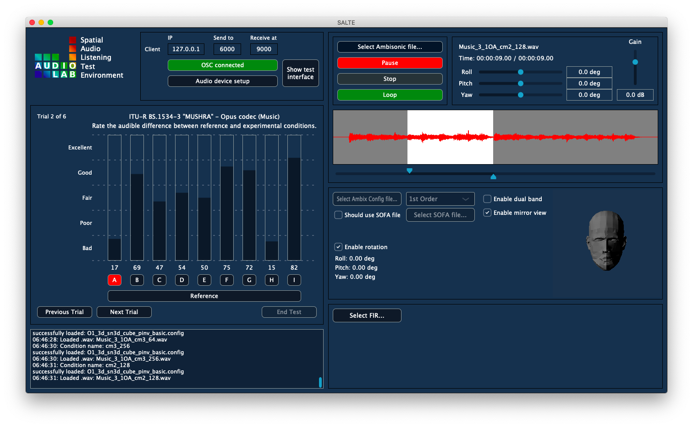

# Spatial Audio Listening Test Environment (SALTE) - Audio Renderer
SALTE is a listening test software created to aid future research and development of spatial audio systems. The tool consists of a dedicated audio rendering engine and [virtual reality interface](https://github.com/AudioLabYork/SALTE-VR-interface) for conducting spatial audio listening experiments.



Spatial Audio Listening Test Environment (SALTE) can be used in the assessment of:
* Spatial audio recording techniques,
* Spatial audio codecs,
* Binaural rendering algorithms,
* Head-Related Transfer Function (HRTF) datasets,
* Virtual soundscapes and room acoustics.

## Features
* Controlled binaural playback of Ambisonic scenes (up to 7th order).
* Head tracking support.
* Built-in flexible listening test interface acommodating standard test paradigms: ITU-R BS.1116, ITU-R BS.1534 ("MUSHRA") and 3GPP TS26.259.
* Networked control of the listening test interface via OSC.
* Support of custom HRTFs contained within separate WAV files or SOFA files.
* FIR-based headphone frequency response compensation.

## Getting Started
SALTE Audio Renderer has been programmed in C++ using [JUCE](https://github.com/WeAreROLI/JUCE/) audio programming framework. Experimental releases can be obtained [here](https://github.com/AudioLabYork/SALTE-audio-renderer/releases). We would like to encourage users to compile the application themselves based on the latest source code.

### How To Compile
* Download Juce.
* Install Visual Studio / Xcode.
* Clone repository.
* Install the required dependencies.
* On Windows add netcdf global path.
* Run Projucer and launch visual studio/xcode.
* Setup Visual Studio/XCode Mtd something setting.
* Build.

### Dependencies
The location of a libraries folder should be placed relative to the project
directory structure as follows:

`../Libraries/`

`../../SALTE-audio-renderer/`

* **SOFA C++ API:** Source for the libsofa library can be found [here](https://github.com/sofacoustics/API_Cpp/). The libsofa directory should be copied to the "Libraries" folder (shown above). This library can then be compiled using Visual Studio/Xcode. It is also required to modify the PATH environment variable to point at the ".dll" location for "netcdf.dll".

* **WDL:** Source for a mirror of the WDL library can be found [here](https://github.com/justinfrankel/WDL/tree/master/WDL). The WDL directory should be copied to the 'Libraries' folder (shown above).

* **ASIO SDK (Windows only):** To build and run the application as ASIO compliant software the Steinberg license agreement must be agreed to and signed, and then the ASIO SDK should be download from [here](https://www.steinberg.net/en/company/developers.html) and its path set in the Projucer settings.

## How To Use SALTE Audio Renderer
After starting the app, the user has to choose the listening test config file (JSON) path as well as CSV file path where the results will be saved after completion of the test. Both paths are saved in a temporarily settings file at the app shutdown, so they can be recalled at the subsequent application launch. To begin the test, enter participant's ID and click Begin. SALTE Audio Renderer can be run in a participant interface mode in which diagnostic information is hidden and only the necessary controls and information are displayed. The results are saved into the CSV text file once the user decide to end the experimental session (by clicking End Test).

### Config File
The JSON config file consists of individual settings for each of the test trials. Config file for simple listening test consisting of single trial based on the ITU-R BS.1116 recommendation is presented below.

```JSON
{
  "trials": [
    {
      "id": "BS1116_speech1_3OA",
      "name": "ITU-R BS.1116-3 - Opus codec (Speech)",
      "instruction": "Rate the audible impairement of the experimental conditions.",
      "scenefolder": "AmbisonicScenes",
      "ambixconfigfolder": "SADIE_II_selected_HRTFs",
      "MushraReference": [
        {
          "name": "reference",
          "source": "Speech_1_3OA_uncomp.wav",
          "order": 3,
          "ambixconfig": "KU100/O3_3d_sn3d_26Leb_pinv_basic.config",
          "gain": 0
        }
      ],
      "MushraConditions": [
        {
          "name": "hid_reference",
          "source": "Speech_1_3OA_uncomp.wav",
          "order": 3,
          "ambixconfig": "KU100/O3_3d_sn3d_26Leb_pinv_basic.config",
          "gain": 0
        },
        {
          "name": "compressed_256kbps",
          "source": "Speech_1_3OA_cm2_256.wav",
          "order": 3,
          "ambixconfig": "KU100/O3_3d_sn3d_26Leb_pinv_basic.config",
          "gain": 0
        }
      ],
      "ratings": [
        "Imperceptible",
        "Perceptible, but not annoying",
        "Slightly annoying",
        "Annoying",
        "Very annoying"
      ]
    }
  ]
}
```

We recommend downloading the [example test session](https://www.google-drive.com/XXX/) which includes more complex test configurations. This package consists of the config file, Ambisonic scenes, ambiX Ambisonic decoder config files and HRTFs.

### Setting Up Head Tracking
Head tracking data can be sent to the renderer via OSC messages containing three arguments (Euler angles) representing head rotation, according to the following pattern:

`"/rendering/htrpy", float roll, float pitch, float yaw`

### Analysing Results
An example of MATLAB code for basic statistical analysis using box plots can be found [here](plotResults.m).

### Additional Settings
Select audio device. If you are using the SALTE VR interfce, make sure that the OSC settings are matching your systems configuration.

## Contributing
SALTE is a collaborative and open source software project. We would like to encourage other researchers to use the framework and participate in its further development. Please contact us if you have any ideas and suggestions how this tool could be improved.

## Authors
* Tomasz Rudzki, email: <tr837@york.ac.uk>
* Chris Earnshaw, email: <chris.earnshaw@york.ac.uk>

## License
GNU General Public License v3.0

## Acknowledgments
* Ambisonic rotation is based on the IEM Plugin Suite implementation which can be found [here](https://git.iem.at/audioplugins/IEMPluginSuite/tree/master/SceneRotator).

* Selected KU100 HRTFs obtained from the SADIE II database.

## Citation

## Safety Note
SALTE is an experimental tool which is in its early stage of development and may contain bugs. Please be aware that it may break anytime during runtime and users might experience unpleasant and loud noises.